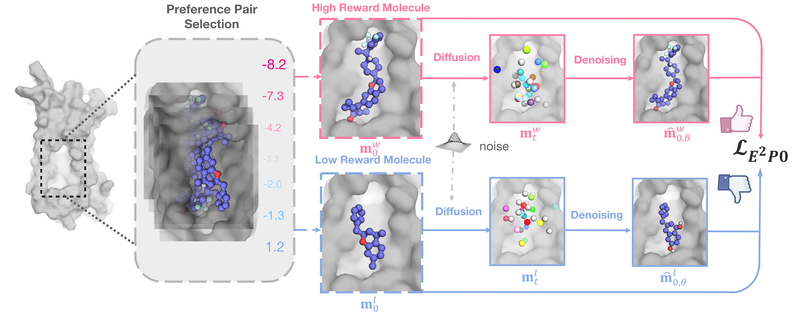

# Aligning Target-Aware Molecule Diffusion Models with Exact Energy Optimization


This repository is the official implementation of Aligning Target-Aware Molecule Diffusion Models with Exact Energy Optimization (NeuIPS 2024). [[PDF]](https://arxiv.org/pdf/2407.01648)

> [**Aligning Target-Aware Molecule Diffusion Models with Exact Energy Optimization**](https://arxiv.org/abs/2407.01648)
> <br>Siyi Gu*, Minkai Xu*, Alexander Powers, Weili Nie, Tomas Geffner, Karsten Kreis, Jure Leskovec, Arash Vahdat, Stefano Ermon
> <br>Stanford University, NVIDIA

<p align="center">
   
</p>


## Environment
```bash
conda create -n target python=3.8
conda activate target
conda install pytorch==2.0.1 pytorch-cuda=11.7 -c pytorch -c nvidia
conda install pyg -c pyg
pip install pyg_lib torch_scatter torch_sparse torch_cluster torch_spline_conv -f https://data.pyg.org/whl/torch-2.0.0+cu117.html
conda install rdkit openbabel tensorboard pyyaml easydict python-lmdb -c conda-forge

# For Vina Docking
pip install meeko==0.1.dev3 scipy pdb2pqr vina==1.2.2 
python -m pip install git+https://github.com/Valdes-Tresanco-MS/AutoDockTools_py3
```

-----
## Training from scratch

### Data Generation

#### SFT Data
The data preparation follows (https://github.com/guanjq/targetdiff).

#### Preference Data
```bash
python gen_data.py
```

### Train
```bash
python scripts/train_ipo.py configs/training_ipo.yml
```

## Sampling
```bash
python scripts/sample_diffusion.py configs/sampling.yml --data_id {i} # Replace {i} with the index of the data. i should be between 0 and 99 for the testset.
```

### Sampling Results
https://drive.google.com/drive/folders/1Auvigp6FLgNKY0i8eVLQf5loFwrIdW0G?usp=sharing

## Evaluation
### Evaluation from sampling results
```bash
python scripts/evaluate_diffusion.py {OUTPUT_DIR} --docking_mode vina_score --protein_root data/test_set
```
The docking mode can be chosen from {qvina, vina_score, vina_dock, none}

### Evaluation results
https://drive.google.com/drive/folders/1eRCcALnBpuVgjUqqRucpZSTtF6oT9pX3?usp=sharing 


## Citation
```
@inproceedings{gu2024aligning,
  title={Aligning Target-Aware Molecule Diffusion Models with Exact Energy Optimization},
  author={Gu, Siyi and Xu, Minkai and Powers, Alexander and Nie, Weili and Geffner, Tomas and Kreis, Karsten and Leskovec, Jure and Vahdat, Arash and Ermon, Stefano},
  booktitle={The Thirty-eighth Annual Conference on Neural Information Processing Systems},
  year={2024},
  url={https://openreview.net/forum?id=EWcvxXtzNu}
}
```
